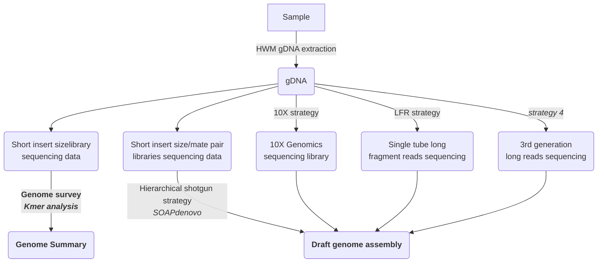

```mermaid
graph TD
    Sample --> |HWM gDNA extraction| B(gDNA)
    B --> C(Short insert sizelibrary<br>sequencing data)
    B --> A(Short insert size/mate pair <br>libraries sequencing data)
    C -->|<b>Genome survey<br><i>Kmer analysis| D(<b>Genome Summary)
    A -->|Hierarchical shotgun strategy<br><i>SOAPdenovo| E(<b>Draft genome assembly)
    B --> |10X strategy| f(10X  Genomics<br> sequencing library)
    f --> E
    B --> |LFR strategy| g(Single tube long<br> fragment reads sequencing)
    g --> E
    B --> |<i>strategy 4| e(3rd generation<br> long reads sequencing)
    e --> E
   
```
